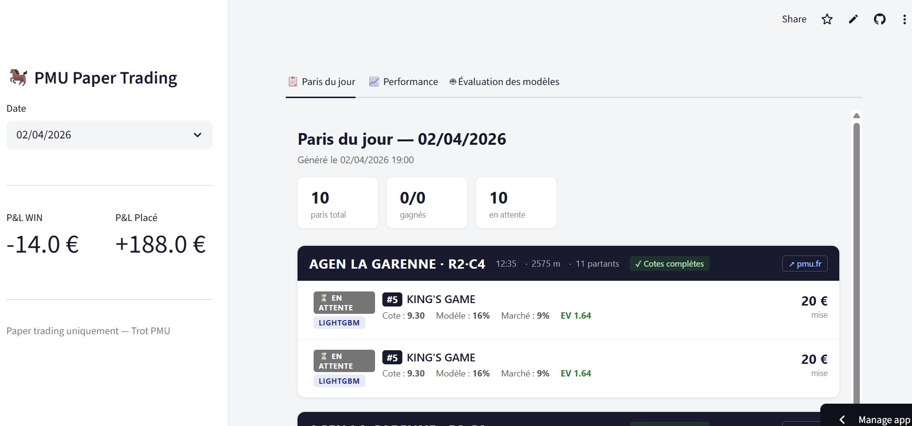

# Hippique Prediction — PMU Trot Paper Trading

Prediction and paper trading system for PMU trot races (Attelé & Monté).
See `FORMULA_TROT.md` for the full selection model breakdown.

---

## Installation

```bash
python -m venv .venv
.venv\Scripts\pip install -r requirements.txt
```

---

## Architecture

```
scraper/   →   features/   →   model/   →   trading/   →   dashboard/
  PMU API       form_score      LightGBM     kelly_stake    Streamlit
  DuckDB        odds_features   Ranker       generate_bets  viewer HTML
                jockey_win_rate backtest     resolve_bets
```

The project is organized into 5 modules:

| Module | Description |
|---|---|
| `src/scraper/` | PMU API client, parsing, DuckDB storage (5 tables incl. `bets`) |
| `src/features/` | Feature engineering: form, odds, jockey win rate (leakage-free) |
| `src/model/` | Scoring (baseline, form, market, combined, LightGBM ranker), backtest |
| `src/trading/` | Kelly stake, bet generation/resolution, APScheduler |
| `src/dashboard/` | Streamlit viewer for daily HTML bet sheets and performance report |
| `config/settings.py` | Paths, PMU API URLs, trading constants |

---

## Scheduler

The scheduler runs in the background and handles the full day automatically:

| Time | Action |
|---|---|
| 08:30 | Scrape program + generate bets + HTML → push to GitHub |
| 10:00 – 22:00 (hourly) | Re-scrape odds + refresh bets + HTML → push to GitHub |
| 22:30 | Scrape results + resolve bets + HTML P&L → push to GitHub |

Manual start (blocking terminal):

```bash
.venv\Scripts\python.exe -c "
from src.trading.scheduler import start_scheduler
start_scheduler()
"
```

Or double-click **`run_scheduler.bat`** at the project root.

---

## Dashboard

```bash
.venv\Scripts\python.exe -m streamlit run src/dashboard/app.py
```

Opens the viewer in the browser. Use the date selector in the sidebar to browse available daily HTML bet sheets.



---

## Tests

```bash
.venv\Scripts\python.exe -m pytest tests/ -v
```

4 test files: scraper, features, backtest, trading.

---

## Auto-start on Windows

### 1. Configure passwordless git push

The scheduler pushes HTML files to GitHub after each update. Git must authenticate silently via the Windows Credential Manager.

1. On GitHub: **Settings → Developer settings → Personal access tokens → Tokens (classic)**
   → **Generate new token** → check `repo` → copy the token
2. In a terminal, once:

```bash
git config --global credential.helper manager
git push   # → enter GitHub username + token as password
```

Subsequent `git push` calls (including from the scheduler) will be silent.

### 2. Windows Task Scheduler

1. Open **Task Scheduler** (`taskschd.msc`)
2. **Create Basic Task…**
   - **Trigger**: *At computer startup* (or *At log on*)
   - **Action**: *Start a program* → select `run_scheduler.bat`
   - **Start in**: project directory path
3. Click **OK** → right-click the task → **Run** to test immediately.

---

## Configuration

File: `config/settings.py`

| Constant | Default | Purpose |
|---|---|---|
| `EV_THRESHOLD` | `1.0` | Minimum EV threshold to place a bet |
| `WIN_EV_THRESHOLD` | `1.0` | EV threshold for WIN bets (LightGBM) |
| `KELLY_FRACTION` | `0.25` | Kelly fraction (conservative sizing) |
| `UNIT_STAKE` | `20.0 €` | Base stake per bet |

---

## Notebooks

| Notebook | Content |
|---|---|
| `01_data_overview.ipynb` | PMU data exploration |
| `02_backtest.ipynb` | Rule-based model backtest (7 sections) |
| `03_live_trading.ipynb` | Live paper trading (schedule, picks, ledger) |
| `04_lgbm.ipynb` | LightGBM Ranker training |
| `05_kaggle_dataset.ipynb` | Kaggle dataset export |
| `06_eda.ipynb` | Exploratory data analysis |

---

## Data

- `data/raw/` — Raw PMU JSON files by date
- `data/processed/hippique.duckdb` — DuckDB database (reunions, races, runners, bets)
- `data/models/` — LightGBM model (`lgbm_ranker.txt`) + medians + weights
- `data/reports/` — Daily HTML bet sheets, performance report, stats
